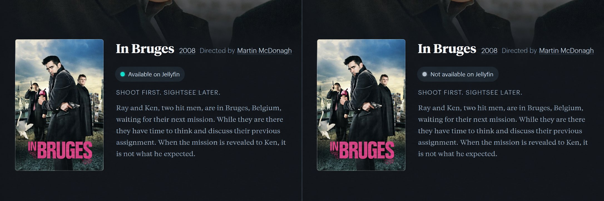
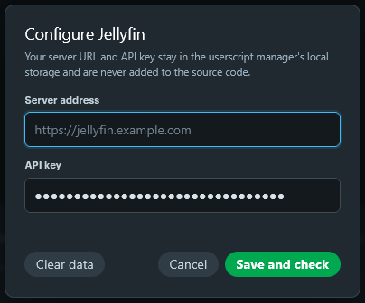

# Jellyboxd

A userscript that shows whether a movie on Letterboxd is available in your Jellyfin library via API.

## Features

- exact TMDB ID matching, with title and year matching as a fallback;
- Jellyfin 12 compatible authentication;
- automatic retries for temporary connection failures.

## Installation

1. Install a userscript manager such as Violentmonkey or Tampermonkey.
2. [Install Jellyboxd](https://raw.githubusercontent.com/ttiaMa/jellyboxd-userscript/main/src/jellyboxd.user.js).
3. Open a Letterboxd movie page and select **Configure**.
4. Enter your Jellyfin server URL and API key.

Updates are installed automatically from this repository.

## Configuration

The Jellyfin server URL and API key are stored locally in the userscript manager's browser storage, separate from the script and its automatic updates.
